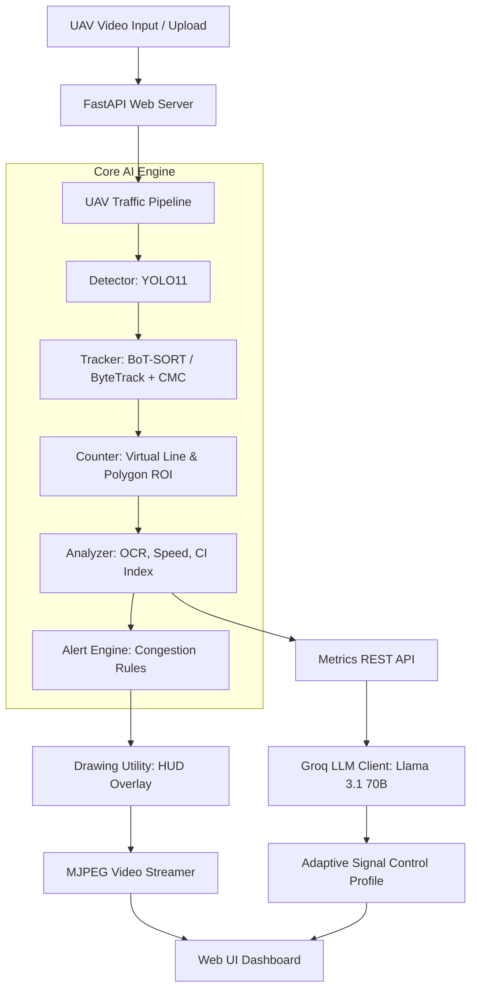

# 🚁 UAV Traffic Intelligent Operations Center (UT-IOC)

> **Hệ thống AI Phát hiện, Theo dõi (MOT), Phân tích Mật độ Phương tiện từ Video UAV & Hỗ trợ Điều khiển Tín hiệu Giao thông Thích ứng bằng LLM**

[](https://www.python.org/)
[](https://github.com/ultralytics/ultralytics)
[](https://fastapi.tiangolo.com/)
[](https://opencv.org/)
[](https://groq.com/)
[](LICENSE)

---

## 📌 Mục lục

- [1. Tổng Quan Dự Án](#1-tổng-quan-dự-án)
- [2. Tính Năng Nổi Bật](#2-tính-năng-nổi-bật)
- [3. Kiến Trúc Hệ Thống](#3-kiến-trúc-hệ-thống)
- [4. Công Nghệ Sử Dụng](#4-công-nghệ-sử-dụng)
- [5. Cấu Trúc Mã Nguồn](#5-cấu-trúc-mã-nguồn)
- [6. Hướng Dẫn Cài Đặt & Khởi Chạy](#6-hướng-dẫn-cài-đặt--khởi-chạy)
- [7. Hướng Dẫn Sử Dụng Dashboard](#7-hướng-dẫn-sử-dụng-dashboard)
- [8. Tài Liệu REST API](#8-tài-liệu-rest-api)
- [9. Script Kiểm Thử & Công Cụ](#9-script-kiểm-thử--công-cụ)
- [10. Đóng Góp & Giấy Phép](#10-đóng-góp--giấy-phép)

---

## 1. Tổng Quan Dự Án

**UAV Traffic Intelligent Operations Center (UT-IOC)** là giải pháp toàn diện kết hợp **Computer Vision (Deep Learning & Multi-Object Tracking)** với **Large Language Models (LLM)** nhằm giải quyết bài toán giám sát giao thông đô thị từ góc nhìn không trung (UAV/Drone/Flycam).

Hệ thống cho phép xử lý luồng video UAV độ phân giải cao (4K), tự động phát hiện đa loại phương tiện, bám vết chính xác ngay cả khi drone rung lắc (nhờ thuật toán BoT-SORT tích hợp Camera Motion Compensation - CMC), tính toán các chỉ số mật độ/tắc nghẽn thời gian thực và sinh khuyến nghị chu kỳ đèn giao thông thích ứng nhờ AI tư duy Llama 3.1 70B qua Groq API.

```
       ┌────────────────────────┐
       │   🚁 UAV Video Input   │
       └───────────┬────────────┘
                   │
                   ▼
  ┌─────────────────────────────────┐
  │  🎯 YOLO11 + BoT-SORT / ByteTrack│  (Detection & MOT with Camera Motion Compensation)
  └────────────────┬────────────────┘
                   │
                   ▼
  ┌─────────────────────────────────┐
  │ 📊 Traffic Analytics & Alerts   │  (Counts, OCR%, Speed, Dwell Time, CI Score)
  └────────────────┬────────────────┘
                   │
                   ▼
  ┌─────────────────────────────────┐
  │ 🤖 Groq LLM Traffic Advisor     │  (Adaptive Traffic Signal Control Recommendation)
  └────────────────┬────────────────┘
                   │
                   ▼
  ┌─────────────────────────────────┐
  │ 💻 Web HUD CCTV Operations UI   │  (Real-time MJPEG Stream, Interactive Chart.js)
  └─────────────────────────────────┘
```

> [!NOTE]
> Dự án được xây dựng theo chuẩn mực nghiên cứu khoa học & ứng dụng thực tiễn cho hệ thống điều hành giao thông thông minh (ITS).

---

## 2. Tính Năng Nổi Bật

### 🎯 1. Phát hiện phương tiện đa lớp (YOLO11)
- Tích hợp mô hình **Ultralytics YOLO11** (`best.pt`) huấn luyện trên dữ liệu UAV.
- Nhận diện chính xác 5 lớp phương tiện chính: `Car`, `Motorcycle`, `Bus`, `Truck`, `Bicycle`.
- Tối ưu nhận diện phương tiện kích thước nhỏ, mật độ dày đặc và camera quay nghiêng/thẳng đứng từ góc nhìn trên cao.

### 🔄 2. Theo dõi đa đối tượng mượt mà (MOT + CMC)
- Chuyển đổi linh hoạt giữa 2 thuật toán MOT state-of-the-art:
  - **BoT-SORT**: Tích hợp **Camera Motion Compensation (CMC)** dựa trên Optical Flow để bù trừ rung lắc, xoay nghiêng của drone.
  - **ByteTrack**: Tốc độ xử lý siêu nhanh, tối ưu cho bài toán phát hiện thiếu khung hình.
- Duy trì **Track ID** ổn định, hạn chế phân mảnh ID (ID Switches).

### 📏 3. Đếm phương tiện & Khoanh vùng ROI thông minh
- **Virtual Counting Line**: Vạch ảo đếm xe cắt qua 2 chiều (In/Out) với tùy chỉnh vị trí thời gian thực.
- **Polygon ROI (Region of Interest)**: Khoanh vùng khu vực giao lộ để đo lường tỷ lệ chiếm dụng mặt đường ($OCR$).

### 📊 4. Đánh giá mật độ & Chỉ số tắc nghẽn ($CI$)
Tự động tính toán các tham số giao thông định lượng:
- **Tỷ lệ chiếm dụng mặt đường ($OCR %$)**: Diện tích xe chiếm trên tổng diện tích ROI.
- **Vận tốc trung bình ($\bar{v}$)**: Tính toán dựa trên độ dịch chuyển khung hình và quy đổi `pixels_per_meter`.
- **Tỷ lệ xe dừng ($R_{stop}$)** & **Thời gian lưu trú ($T_{wait}$)**.
- **Chỉ số Tắc nghẽn Tổng hợp ($CI \in [0, 100]$)**: Đánh giá đa tham số mức độ ùn tắc giao thông.

### 🚨 5. Động cơ cảnh báo đa cấp (Traffic Alert Engine)
- Cảnh báo tự động theo từng cấp độ: `Thông thoáng` 🟢, `Mật độ cao` 🟡, `Ùn tắc cục bộ` 🟠, `Dừng xe hàng loạt (Gridlock)` 🔴.

### 🚦 6. Tích hợp Groq LLM (Llama 3.1 70B) điều khiển đèn tín hiệu thích ứng
- Tự động truyền các tham số giao thông thời gian thực vào Prompt Engine.
- Tự động sinh báo cáo **Traffic Control Profile**:
  - Thời lượng đèn Xanh / Đỏ cho Hướng ưu tiên & Hướng phụ.
  - Sơ đồ chu kỳ tín hiệu trực quan.
  - Lý do phân bổ điều khiển logic & khoa học.

### 💻 7. Giao diện Web CCTV HUD Chuyên nghiệp
- Phong cách thiết kế **Dark Glassmorphism CCTV Operations Center**.
- Stream luồng video MJPEG 60 FPS mượt mà qua HTTP multipart.
- Biểu đồ tương tác thời gian thực với Chart.js (Line chart diễn biến mật độ, Donut chart phân bổ loại xe).
- Bảng nhật ký dữ liệu chi tiết kèm tính năng **Xuất CSV**.

---

## 3. Kiến Trúc Hệ Thống

Dự án áp dụng kiến trúc phân tầng dạng **Modular Pipeline** giúp dễ dàng mở rộng và bảo trì:



---

## 4. Công Nghệ Sử Dụng

| Thành Phần | Thư Viện / Công Nghệ | Phiên Bản | Vai Trò & Lý Do Lựa Chọn |
| :--- | :--- | :--- | :--- |
| **Ngôn ngữ** | Python | `>= 3.10` | Chuẩn công nghiệp cho AI, Computer Vision & Data Science |
| **Deep Learning** | Ultralytics YOLO11 | `>= 8.2.0` | SOTA Object Detection, tối ưu cho vật thể nhỏ từ góc nhìn UAV |
| **MOT Tracking** | BoT-SORT & ByteTrack | Custom YAML | Phân tích quỹ đạo, BoT-SORT có CMC bù rung chuyển động drone |
| **Thị Giác Máy Tính** | OpenCV | `>= 4.8.0` | Đọc/ghi video, tính Optical Flow, vẽ HUD Overlay & ROI |
| **Backend Framework** | FastAPI + Uvicorn | `>= 0.110.0` | Server bất đồng bộ (async), hỗ trợ MJPEG Streaming & REST API nhẹ |
| **LLM Reasoning** | Groq Cloud API | `llama-3.1-70b` | Suy luận tốc độ cao (>300 tokens/s) lập kế hoạch pha đèn thích ứng |
| **Frontend UI** | HTML5, CSS3, JavaScript | Modern ES6 | Thiết kế Dark Glassmorphism, gọi REST API & stream native MJPEG |
| **Trực Quan Hóa** | Chart.js | `4.x` | Biểu đồ Canvas tương tác thời gian thực nhẹ & mượt |

---

## 5. Cấu Trúc Mã Nguồn

```
📁 software_technology/
├── 📁 configs/                         # Cấu hình thuật toán Tracking
│   ├── botsort_custom.yaml             # Cấu hình BoT-SORT (Bật CMC OpenCV)
│   └── bytetrack_custom.yaml           # Cấu hình ByteTrack
│
├── 📁 core/                            # 🧠 THƯ VIỆN LÕI AI & PHÂN TÍCH GIAO THÔNG
│   ├── alert.py                        # Động cơ cảnh báo ngưỡng ùn tắc giao thông
│   ├── analyzer.py                     # Tính mật độ OCR, vận tốc, dwell time & chỉ số CI
│   ├── counter.py                      # Bộ đếm phương tiện vạch ảo & ROI Polygon
│   ├── detector.py                     # Wrapper nhận diện vật thể với YOLO11
│   └── tracker.py                      # Bộ bám vết phương tiện (BoT-SORT / ByteTrack)
│
├── 📁 llm/                             # 🤖 MODULE AI TƯ DUY & ĐIỀU KHIỂN TÍN HIỆU
│   └── traffic_profile.py              # Groq API Client sinh bản tư vấn chu kỳ đèn
│
├── 📁 models/                          # 📦 TRỌNG SỐ MÔ HÌNH DEEP LEARNING
│   ├── best.pt                         # Trọng số YOLO11 fine-tuned trên dữ liệu UAV
│   └── best_2_dataset.pt               # Trọng số bổ sung cho tập dataset mở rộng
│
├── 📁 outputs/                         # Thư mục chứa kết quả xuất (Video/Images/CSV)
│
├── 📁 scripts/                         # Script tiện ích & công cụ xử lý
│   └── frames_to_video.py              # Script đóng gói ảnh frame thành video MP4
│
├── 📁 tests/                           # Unit tests cho hệ thống
│
├── 📁 utils/                           # 🛠️ UTILITIES & CONFIG HỆ THỐNG
│   ├── config.py                       # Bảng màu BGR, nhãn class, đường dẫn mặc định
│   └── drawing.py                      # Hàm vẽ BBox, vệt di chuyển (trails), HUD & Vạch ảo
│
├── 📁 videos/                          # Thư mục lưu trữ video mẫu & video tải lên
│   └── temp_uploads/                   # Lưu trữ tạm các file video người dùng upload
│
├── 📁 web/                             # 🎨 FRONTEND WEB DASHBOARD
│   ├── 📁 static/                      # Static assets (CSS, JS, CSS Themes)
│   │   ├── 📁 css/
│   │   │   └── styles.css              # Dark Glassmorphism CCTV Dashboard Styling
│   │   └── 📁 js/
│   │       └── app.js                  # Polling metrics, Chart.js & gọi REST API
│   └── 📁 templates/
│       └── index.html                  # Giao diện HTML chính (Multi-tab CCTV Layout)
│
├── .env.example                        # Mẫu file cấu hình biến môi trường
├── pipeline.py                         # 🔗 Pipeline kết nối tuần tự toàn bộ Core AI
├── requirements.txt                    # Danh sách thư viện Python cần thiết
├── server.py                           # 🚀 FastAPI Backend Server & Streaming Engine
├── test_detect.py                      # Script test nhanh YOLO11 & đo FPS
└── README.md                           # Tài liệu hướng dẫn sử dụng chuyên nghiệp
```

---

## 6. Hướng Dẫn Cài Đặt & Khởi Chạy

### 📋 Yêu cầu hệ thống
- **Hệ điều hành**: Windows 10/11, Ubuntu 20.04+, macOS
- **Python**: `Python 3.10` đến `3.12`
- **GPU (Khuyên dùng)**: NVIDIA GPU với CUDA 11.8 / 12.1 để đạt hiệu năng 30-60 FPS. (Hệ thống vẫn hỗ trợ chạy trên CPU).

### 🚀 Các bước triển khai

#### Bước 1: Clone kho lưu trữ dự án
```bash
git clone https://github.com/tutran27/cnpm.git
cd cnpm
```

#### Bước 2: Tạo môi trường ảo (Virtual Environment)
```bash
# Trên Windows
python -m venv .venv
.venv\Scripts\activate

# Trên Linux/macOS
python3 -m venv .venv
source .venv/bin/activate
```

#### Bước 3: Cài đặt các thư viện phụ thuộc
```bash
pip install --upgrade pip
pip install -r requirements.txt
```

#### Bước 4: Cấu hình biến môi trường (`.env`)
Tạo file `.env` từ file mẫu `.env.example`:
```bash
# Trên Windows PowerShell
Copy-Item .env.example .env

# Trên Linux/macOS
cp .env.example .env
```
Mở file `.env` và nhập API Key của bạn từ Groq Cloud (để sử dụng tính năng tư vấn LLM):
```env
GROQ_API_KEY=gsk_your_actual_groq_api_key_here
```
*(Nếu không có Groq API Key, các tính năng nhận diện, tracking và phân tích mật độ vẫn hoạt động bình thường, module LLM sẽ trả về khuyến nghị mẫu mô phỏng).*

#### Bước 5: Kiểm tra file trọng số Model
Đảm bảo file trọng số YOLO11 đã nằm trong thư mục `models/`:
- [`models/best.pt`](file:///d:/software_technology/models/best.pt) hoặc [`models/best_2_dataset.pt`](file:///d:/software_technology/models/best_2_dataset.pt).

#### Bước 6: Khởi chạy Web Server
Chạy server FastAPI bằng lệnh:
```bash
python server.py
```
Hoặc dùng `uvicorn` trực tiếp:
```bash
uvicorn server:app --host 0.0.0.0 --port 8501 --reload
```

#### Bước 7: Truy cập Giao diện Dashboard
Mở trình duyệt web và truy cập địa chỉ:
👉 **`http://localhost:8501`** hoặc **`http://127.0.0.1:8501`**

---

## 7. Hướng Dẫn Sử Dụng Dashboard

Giao diện Web UT-IOC bao gồm 3 khu vực chức năng chính:

```
┌─────────────────────────────────────────────────────────────────────────────────────────┐
│  🚁 UAV TRAFFIC INTELLIGENT OPERATIONS CENTER                         [● LIVE SYSTEM]   │
├─────────────────────────────────────────────────────────────────────────────────────────┤
│ 🎮 CONTROL BAR: [▶ Run]  [⏸ Pause]  [⏹ Stop]  [🔄 Reset]                              │
├─────────────────────────┬───────────────────────────────────────────────────────────────┤
│ ⚙️ SIDEBAR CONFIG       │ 📑 TABS CHÍNH                                                 │
│                         ├───────────────────────────────────────────────────────────────┤
│ • Nguồn Video           │ 🎥 TAB 1: Giám Sát Realtime & Phân Tích Mật Độ (70/30)        │
│ • Tracker Selection     │ • Khung Video Streaming HUD (BBox, Track ID, Speed, Vạch Y)   │
│ • Conf / IoU Sliders    │ • Metrics Grid (Car, Motor, Bus, Truck counts)                │
│ • Vạch Đếm Y Slider     │ • Gauge Mật Độ OCR % & Congestion Index (CI)                  │
│ • Frame Skip & Speed    │ • Cảnh báo ùn tắc tức thì                                     │
│                         ├───────────────────────────────────────────────────────────────┤
│                         │ 🚦 TAB 2: Điều Khiển Đèn Tín Hiệu Thích Ứng (Groq LLM)        │
│                         │ • Đồng bộ dữ liệu dòng xe realtime                            │
│                         │ • Nút [🚀 Sinh Khuyến Nghị Llama 3.1]                         │
│                         │ • Sơ đồ chu kỳ tín hiệu & Báo cáo chi tiết                    │
│                         ├───────────────────────────────────────────────────────────────┤
│                         │ 📊 TAB 3: Báo Cáo & Thống Kê Tổng Hợp                         │
│                         │ • Biểu đồ Donut tỷ lệ phương tiện                             │
│                         │ • Biểu đồ Line diễn biến mật độ theo thời gian                │
│                         │ • Bảng dữ liệu lịch sử & Nút [📥 Xuất CSV]                    │
└─────────────────────────┴───────────────────────────────────────────────────────────────┘
```

### 🛠️ Thao tác sử dụng chính:
1. **Thay đổi Nguồn Video**:
   - Chọn video từ danh sách mẫu UAV có sẵn trong Sidebar.
   - Hoặc tải lên file `.mp4`, `.avi`, `.mov` tùy chỉnh của bạn qua form **Upload Video**.
2. **Điều chỉnh tham số AI tức thì**:
   - Chuyển đổi giữa **BoT-SORT** (Bù chuyển động camera drone) và **ByteTrack** (Tốc độ cao).
   - Kéo thanh slider vị trí **Vạch đếm Y** để thay đổi vị trí vạch đếm xe trên khung hình.
   - Tinh chỉnh **Confidence Threshold** và **IoU Threshold**.
3. **Sinh Khuyến Nghị Điều Khiển Đèn Giao Thông**:
   - Mở **Tab 2 (Điều khiển đèn thích ứng)**.
   - Nhấn nút **"Sinh khuyến nghị LLM"**, hệ thống sẽ gửi chỉ số giao thông hiện tại tới Groq Llama 3.1 70B và hiển thị phương án phân bổ thời gian đèn Xanh/Đỏ tối ưu.
4. **Xuất Báo Cáo**:
   - Mở **Tab 3 (Báo cáo & Thống kê)**.
   - Xem biểu đồ biến động lưu lượng và bấm **"Xuất CSV"** để tải dữ liệu về máy.

---

## 8. Tài Liệu REST API

FastAPI cung cấp các REST Endpoints chuẩn cho phép tích hợp với các hệ thống bên ngoài:

### 🎥 Stream Video & Giao Diện
| Endpoint | Method | Mô Tả |
| :--- | :--- | :--- |
| `/` | `GET` | Trả về trang Web Dashboard (HTML Templates) |
| `/video_feed` | `GET` | Stream luồng video MJPEG `multipart/x-mixed-replace` |

### 📊 Metrics & Điều Khiển
| Endpoint | Method | Request Body / Params | Mô Tả |
| :--- | :--- | :--- | :--- |
| `/api/status` | `GET` | N/A | Lấy trạng thái hiện tại của Pipeline (Video path, Tracker, Status) |
| `/api/metrics` | `GET` | N/A | Lấy chỉ số đếm xe, OCR%, Speed, Alert Level, CI Index realtime |
| `/api/control` | `POST` | `{"action": "play\|pause\|stop\|reset"}` | Điều khiển luồng video |
| `/api/config` | `POST` | `{"tracker_name": "BoT-SORT", "conf": 0.25, "line_y": 600}` | Cập nhật cấu hình AI tức thời |
| `/api/upload_video` | `POST` | `Multipart Form (file)` | Upload file video mới lên server |
| `/api/llm/recommendation` | `POST` | `{"intersection_name": "Ngã tư A"}` | Yêu cầu Groq LLM sinh bản khuyến nghị pha đèn |
| `/api/export_csv` | `GET` | N/A | Tải file CSV chứa lịch sử thống kê giao thông |

---

## 9. Script Kiểm Thử & Công Cụ

Dự án cung cấp các script độc lập phục vụ kiểm thử và đóng gói:

### 🧪 1. Script kiểm tra nhận diện & tracking (`test_detect.py`)
Dùng để test nhanh mô hình YOLO11 & bám vết trực tiếp trên 1 ảnh hoặc video mà không cần bật Web Server:
```bash
# Test nhận diện trên 1 ảnh
python test_detect.py --source videos/test_frame.jpg --show

# Test bám vết trên video với BoT-SORT
python test_detect.py --source videos/DJI_20250516071323_0341_D.MP4 --tracker BoT-SORT --show
```

### 🎞️ 2. Script ghép frame thành Video MP4 (`scripts/frames_to_video.py`)
Chuyển đổi thư mục chứa các ảnh frame thành video MP4 chuẩn:
```bash
python scripts/frames_to_video.py --input_dir outputs/frames --output outputs/result.mp4 --fps 30
```

---

## 10. Đóng Góp & Giấy Phép

### 🤝 Đóng góp dự án
Mọi đóng góp, báo lỗi (issues) hoặc đề xuất tính năng mới (pull requests) đều được chào đón! 
1. Fork repository này.
2. Tạo nhánh tính năng mới (`git checkout -b feature/AmazingFeature`).
3. Commit thay đổi (`git commit -m 'Add some AmazingFeature'`).
4. Push lên branch (`git push origin feature/AmazingFeature`).
5. Mở Pull Request.

### 📄 Giấy phép (License)
Dự án được phát hành dưới bản quyền **MIT License**. Chi tiết xem tại file `LICENSE`.

---

<div align="center">

**Developed with ❤️ by Deep Learning & Intelligent Transportation Systems Research Team**

*Hệ thống Giám sát & Điều khiển Giao thông Thông minh UAV*

</div>
